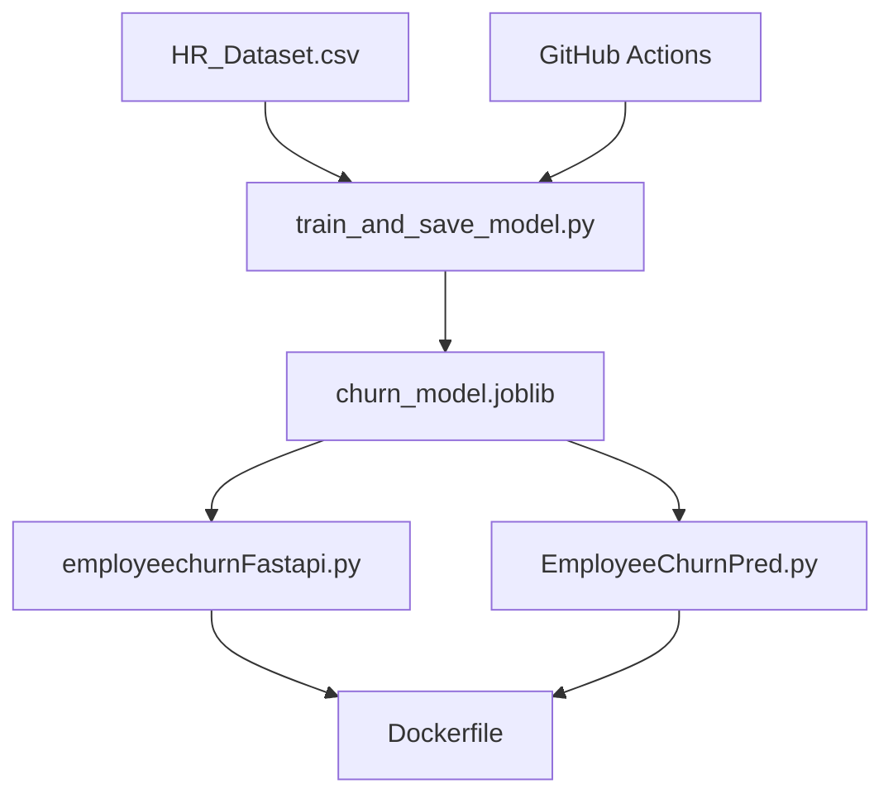

# Employee Churn Prediction

This project provides a complete machine learning pipeline for predicting employee churn, including data preprocessing, model training, evaluation, and deployment via FastAPI and Streamlit.

## Project Structure

```text
.
├── .github/workflows/
│   └── main.yml                  # CI Pipeline
├── EmployeeChurnPrediction_fixed.ipynb # Research & Development Notebook
├── HR_Dataset.csv                # Raw Data
├── train_and_save_model.py       # Production Training Script
├── churn_model.joblib            # Serialized Best Model (RF)
├── employeechurnFastapi.py       # Backend API (FastAPI)
├── EmployeeChurnPred.py          # Frontend Dashboard (Streamlit)
├── Dockerfile                    # Containerization Setup
├── requirements.txt              # Dependency List
└── README.md                     # Project Documentation/Instructions
```

### Components Diagram


## Setup and Installation

### Local Setup

1. Install the required dependencies:
   ```bash
   pip install -r requirements.txt
   ```

2. Train the model (optional if `churn_model.joblib` already exists):
   ```bash
   python train_and_save_model.py
   ```

### Running the Application

- **API (FastAPI)**:
  ```bash
  uvicorn employeechurnFastapi:app --reload
  ```
  Access the API documentation at `http://localhost:8000/docs`.

- **UI (Streamlit)**:
  ```bash
  streamlit run EmployeeChurnPred.py
  ```
  Access the dashboard at `http://localhost:8501`.

### Docker Deployment

1. Build the Docker image:
   ```bash
   docker build -t employee-churn-pred .
   ```

2. Run the container:
   ```bash
   docker run -p 8000:8000 -p 8501:8501 employee-churn-pred
   ```

## Model Performance
The Random Forest model achieves approximately **99% accuracy** on the test set, with a strong emphasis on precision and recall for both churn and stay classes.

## Features
- Interactive Streamlit Dashboard
- RESTful API with FastAPI
- Automated CI Pipeline with GitHub Actions
- Containerized for easy deployment
