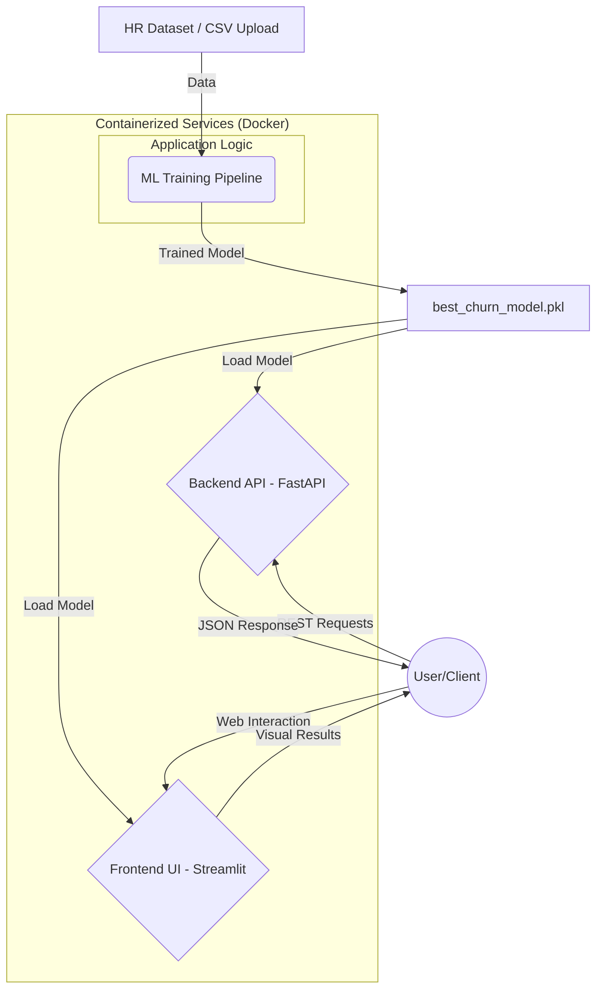

# 🎯 Employee Churn Prediction

This project provides a complete machine learning pipeline for predicting employee churn, including data preprocessing, model training, evaluation, and deployment via FastAPI and Streamlit.

## 📊 Project Overview

This project implements an end-to-end ML pipeline that:
- Trains multiple models (RandomForest, XGBoost, LightGBM, CatBoost)
- Automatically selects the best performing model
- Provides a REST API for predictions
- Offers an interactive web interface for real-time predictions

**Best Model Performance:** RandomForest with **98.87% accuracy**

## 🏗️ Project Architecture

The following diagram illustrates the high-level architecture of the Employee Churn Prediction system:


```mermaid
graph TD
    A[HR Dataset / CSV Upload] -->|Data| B(ML Training Pipeline)
    B -->|Trained Model| C[best_churn_model.pkl]
    C -->|Load Model| D{Backend API - FastAPI}
    C -->|Load Model| E{Frontend UI - Streamlit}
    
    subgraph "Containerized Services (Docker)"
        D
        E
    subgraph "Application Logic"
        B
    end
    end

    User((User/Client)) -->|REST Requests| D
    User -->|Web Interaction| E
    D -->|JSON Response| User
    E -->|Visual Results| User
```

### Core Components:
1.  **Data Source**: Historical HR data containing employee attributes and churn status.
2.  **ML Pipeline**: Scikit-learn based training script (`churn_prediction.py`) that pre-processes data and trains the best model.
3.  **Model Storage**: The serialized `best_churn_model.pkl` file, used by both API and UI.
4.  **FastAPI Backend**: Provides high-performance REST endpoints for programmatic access to the model (`Fastapi.py`).
5.  **Streamlit Frontend**: An interactive dashboard for easy human-model interaction (`EmployeeChurnPred.py`).

## 📁 Project Structure

```
EmployeeChurnPrediction/
│
├── HR_Dataset.csv                    # Training data (15,000 employee records)
├── HR_Dataset_test.csv               # Test data for batch prediction
├── best_churn_model.pkl              # Saved best model (generated after training)
│
├── churn_prediction.py               # Main training script
├── Fastapi.py                        # FastAPI backend
├── EmployeeChurnPred.py              # Streamlit frontend
├── verify_imports.py                 # Import validation script
│
├── requirements.txt                  # Python dependencies
├── Dockerfile                        # Docker configuration
├── README.md                         # This file
│
└── .github/
    └── workflows/
        └── main.yml                  # GitHub Actions CI/CD pipeline
```

## 🚀 Features

### Data Processing
- **StandardScaler** for numeric features (satisfaction_level, last_evaluation, etc.)
- **OneHotEncoder** for categorical features (Departments)
- **OrdinalEncoder** for ordinal features (salary: low < medium < high)
- Complete scikit-learn Pipeline for reproducibility

### Model Training
- Supports multiple algorithms: RandomForest, XGBoost, LightGBM, CatBoost
- Automatic best model selection based on accuracy
- Model persistence using joblib
- Sample prediction validation

### API (FastAPI)
- RESTful API with automatic documentation
- Input validation using Pydantic
- Model probability scores
- Swagger UI at `/docs`

### Frontend (Streamlit)
- Interactive web interface
- Real-time predictions
- User-friendly input forms
- Visual feedback for predictions

## 🛠️ Installation

### Local Setup

1. Install the required dependencies:
   ```bash
   pip install -r requirements.txt
   ```

**Note:** If `catboost` or `lightgbm` fail to install (common on Python 3.14), the project will still work with RandomForest and XGBoost.

## 📚 Usage

### 1. Train the Model

Run the training script to process data, train models, and save the best one:

```bash
python churn_prediction.py
```

**Output:**
- Trains RandomForest and XGBoost models
- Displays accuracy, precision, recall, and F1-score for each
- Saves the best model to `best_churn_model.pkl`
- Runs a sample prediction to verify the model

### 2. Run the API (FastAPI)

Start the FastAPI backend server:

```bash
python -m uvicorn Fastapi:app --reload
```

**Access Points:**
- API: `http://127.0.0.1:8000`
- Swagger UI: `http://127.0.0.1:8000/docs`
- ReDoc: `http://127.0.0.1:8000/redoc`

**Example API Request:**
```bash
curl -X POST "http://127.0.0.1:8000/predict" \
  -H "Content-Type: application/json" \
  -d '{
    "satisfaction_level": 0.1,
    "last_evaluation": 0.9,
    "number_project": 6,
    "average_montly_hours": 250,
    "time_spend_company": 4,
    "Work_accident": 0,
    "promotion_last_5years": 0,
    "Departments": "sales",
    "salary": "low"
  }'
```

### 3. Run the Streamlit App

Launch the interactive web interface:

```bash
python -m streamlit run EmployeeChurnPred.py
```

**Access:** `http://localhost:8501` (or the port shown in terminal)

**Features:**
- Input employee details via sliders and dropdowns
- Click "Predict Churn" for instant results
- **Batch Prediction**: Upload `HR_Dataset_test.csv` to predict for multiple employees at once.
- Visual feedback (success/error messages)

## 🐳 Docker Deployment

### Build the Docker Image
```bash
docker build -t employee-churn-app .
```

### Run the API Container
```bash
docker run -p 8000:8000 employee-churn-app
```

### Run the Streamlit Container
```bash
docker run -p 8501:8501 employee-churn-app streamlit run EmployeeChurnPred.py
```

### 🧪 Experiment Tracking with MLflow (New)

The project now includes MLflow for tracking training runs, model parameters, and performance metrics.

**To view experiments:**
1. Run the training script: `python churn_prediction.py`
2. Start the MLflow UI: `mlflow ui` (or use Docker Compose)
3. Access the UI at: `http://localhost:5000`

### 🛠️ Using Docker Compose (Recommended)

The easiest way to run both the API and the UI simultaneously is using Docker Compose:

```bash
docker-compose up --build
```

**Services will be available at:**
- **API**: `http://localhost:8000`
- **Frontend**: `http://localhost:8501`
- **MLflow UI**: `http://localhost:5000`

Docker Compose ensures the API is healthy before starting the UI service.

## 📊 Dataset Features

| Feature | Type | Description |
|---------|------|-------------|
| satisfaction_level | Float (0-1) | Employee satisfaction level |
| last_evaluation | Float (0-1) | Last performance evaluation score |
| number_project | Integer | Number of projects completed |
| average_montly_hours | Integer | Average monthly working hours |
| time_spend_company | Integer | Years at company |
| Work_accident | Binary (0/1) | Whether had a work accident |
| promotion_last_5years | Binary (0/1) | Promoted in last 5 years |
| Departments | Categorical | Department (sales, hr, technical, etc.) |
| salary | Ordinal | Salary level (low, medium, high) |
| **left** | **Binary (0/1)** | **Target: Whether employee left** |

## 🤖 Model Performance

| Model | Accuracy | Precision | Recall | F1-Score |
|-------|----------|-----------|--------|----------|
| RandomForest | 98.87% | 0.9855 | 0.9660 | 0.9757 |
| XGBoost | 98.80% | 0.9841 | 0.9646 | 0.9742 |

**Note:** LightGBM and CatBoost were not evaluated due to environment compatibility.

## 🔧 CI/CD Pipeline

GitHub Actions workflow automatically:
1. Sets up Python 3.9
2. Installs dependencies
3. Runs `churn_prediction.py` to verify training
4. Can be extended to build Docker images

**Trigger:** Push to `main` branch

## 🧪 Testing

Verify all imports and syntax:
```bash
python verify_imports.py
```

## 🛡️ Error Handling

- Missing model file: Returns 500 error with clear message
- Invalid input: Pydantic validation with detailed error messages
- Streamlit app: Graceful error display with user-friendly messages

## 🔮 Future Enhancements

- [ ] Add feature importance visualization
- [ ] Implement model retraining endpoint
- [ ] Add authentication to API
- [ ] Create prediction history dashboard

## 📝 License

This project is open source and available under the MIT License.

---

**Built with:** Python, scikit-learn, FastAPI, Streamlit, Docker, MLflow
